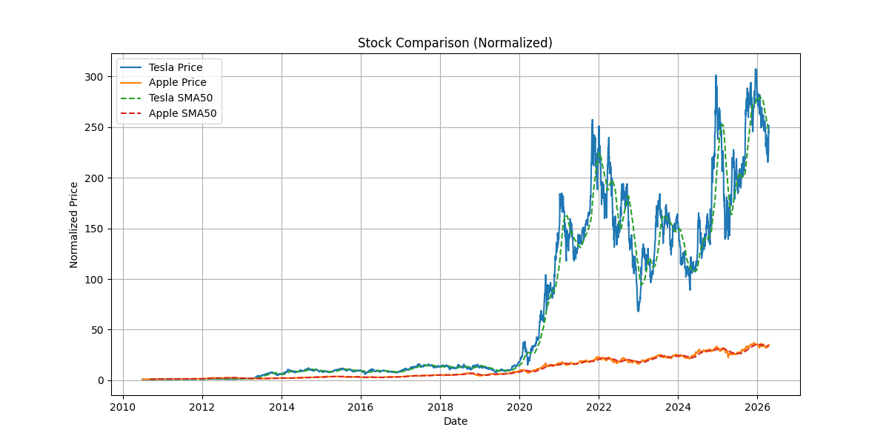

#  Stock Price Comparison Tool

A Python-based data analysis project that compares the performance of two stocks using normalization and moving averages.

---

# Features

* Fetch historical stock data using `yfinance`
* Combine multiple stock datasets
* Handle missing values (forward fill & backward fill)
* Normalize stock prices for fair comparison
* Calculate moving averages (SMA20 & SMA50)
* Visualize:

  * Individual stock performance
  * Comparative performance in a single chart

---

# Technologies Used

* Python
* pandas
* matplotlib
* yfinance

---

# How It Works

1. Fetch stock data from Yahoo Finance
2. Merge datasets based on date
3. Clean missing values
4. Normalize stock prices
5. Calculate moving averages
6. Plot graphs for analysis


# Example Stocks Used

* Tesla (TSLA)
* Apple (AAPL)

---

 How to Run

Install dependencies:

```bash
pip install yfinance pandas matplotlib
```

Run the script:

```bash
python main.py
```

---

# Output

# Stock Comparison Graph



---

# Key Concepts

* Time Series Analysis
* Data Cleaning
* Feature Engineering
* Moving Averages (SMA)
* Data Visualization

---


Abhijeet

---


